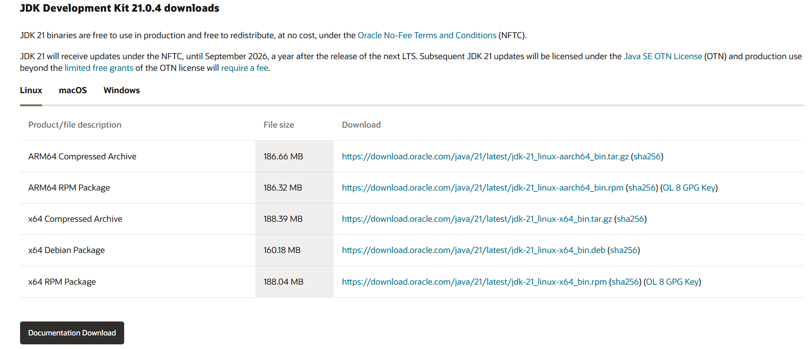
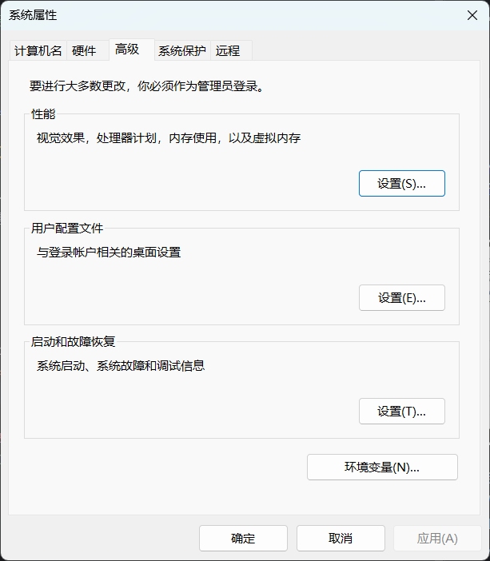
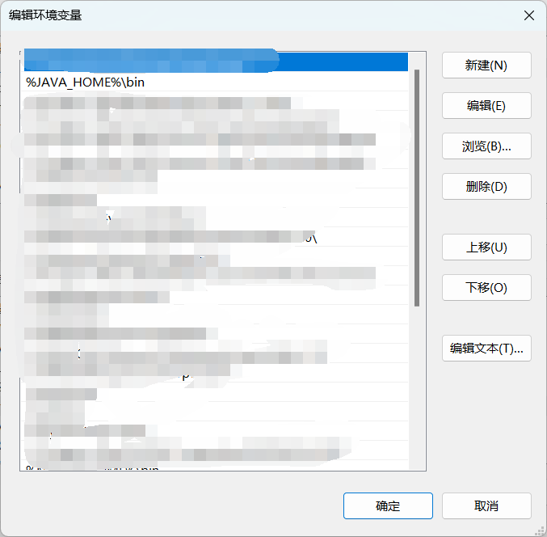
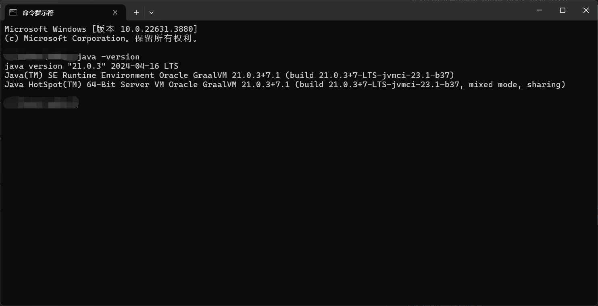

# 0.1 构建开发环境
> 阅读此教程，你将了解如何构建PowerNukkitX的插件开发环境

假如你只会Java最基础的内容，那我相信你肯定能会开发插件。你再看完我写完的入门，你肯定事半功倍了。
<br />如果是有编程基础的人，快速入门可以为你们快速掌握PNX的插件开发。

## 一，关于搭建开发环境前准备
### 1.1 安装JDK 21
> 请确保你的电脑上已经安装了JDK 21，如果没有安装，请先安装JDK 21

我们的开发需要使用Java，所以需要下载java开发工具包JDK
<br />请访问Oracle官网下载JDK 21
https://www.oracle.com/java/technologies/downloads/#java21



安装JDK，安装过程中可以自定义安装目录等信息，例如我们选择安装目录为**C:\Program Files (x86)\Java\graalvm-jdk-21.0.3+7.1**

### 1.2 选择并安装IDE
> 正所谓工欲善其事必先利其器，如果没有好的工具，那么开发效率将会大大降低。

目前市场上的 IDE 很多，本文为大家推荐以下下几款 Java 开发工具：
1. IntelliJ IDEA : IntelliJ IDEA（简称 IDEA）是 JetBrains 公司开发的 Java 集成开发环境（IDE）。
2. VSCode : VSCode（全称：Visual Studio Code）是一款由微软开发且跨平台的免费源代码编辑器。
3. Eclipse : Eclipse 是一个开放源代码的、基于 Java 的可扩展开发平台。

本文使用IntelliJ IDEA作为开发工具
 
### 1.3 下载测试用服务端
> 如果您使用Windows系统，您可能需要取消UWP本地回环限制

请访问PowerNukkitX的GitHub releases页面，下载最新版本的测试用服务端
<br />https://github.com/PowerNukkitX/PowerNukkitX/releases/tag/snapshot
<br />下载PowerNukkitX-Run.zip，解压后得到PowerNukkitX-Run文件夹。
<br />在cli.jar文件同级目录下新建start.bat，输入以下命令
```shell
java -jar cli.jar
```
双击start.bat文件即可启动服务端，初次启动需选择语言

## 二，搭建开发环境
### 2.1 配置JDK环境变量
你还需要配置环境变量，以便于让操作系统找到Java的相关内容。安装目录为上述提到的例子，为
<br />**C:\Program Files (x86)\Java\graalvm-jdk-21.0.3+7.1**

<br />作者以windows 11为例，配置环境变量步骤如下：
1. 在搜索栏中输入"编辑系统环境变量"
2. 点击"编辑系统环境变量"
   
3. 点击"环境变量"
4. 点击新建系统变量名为"JAVA_HOME"，值为"C:\Program Files (x86)\Java\graalvm-jdk-21.0.3+7.1"并保存
5. 在系统变量中找到Path变量点击进行编辑
6. 在Path变量中添加"%JAVA_HOME%\bin"并保存
   
7. 建议重启电脑

为了保证你成功配置了环境变量，可以测试JDK是否安装成功
1. 打开命令行工具，输入"java -version"
2. 输出如下信息则表示安装成功
   

### 2.2 配置项目管理工具
对于Java而言，主流的工具有两种。
<br />
1. gradle : Gradle 是一个基于Apache Ant和Apache Maven概念的项目自动化构建工具，它使用一种基于Groovy的特定领域语言（DSL）来声明项目设置，目前也增加了基于Kotlin语言的kotlin-dsl
2. maven : Apache Maven 是一个软件项目管理和 comprehension工具。基于项目对象模型（缩写：POM），Maven利用一个标准化的项目描述文件（通常为pom.xml）来管理项目的构建，报告和文档。

本文使用maven作为项目管理工具，但我还是推荐gradle。这两者的安装和配置几乎跟配置jdk环境大致相同，这里就不再赘述了。
<br />如果仍然有问题，可以百度或者请教他人。

## 三，快速使用服务端
> 你需要学会开启服务端，才能学会将插件加载于服务端中。

我想本文不止局限于开发人员，这节其实更适合于腐竹和普通玩家选择的方案。
<br />根据需求而言，我把使用方案分为了三种。

### 3.1 直接使用已有的服务端
如上文使用测试服务端即可
相关配置参考[PNX官方文档](https://docs-pnx.pages.dev/)

### 3.2 使用群组方案
使用反向代理，将服务端部署在服务器上，然后通过反向代理软件访问多个服务端。目前支持的反向代理只有Waterdog-PNX版本。
<br />使用群组并不会帮助服务端优化，最多只能分担服务器中单个服务端的承受压力。

### 3.3 使用跨服插件
使用跨服插件，将服务端部署在服务器上，然后通过跨服插件将多个服务端连接在一起。这与反向代理实现的功能和需求是差不多的。


