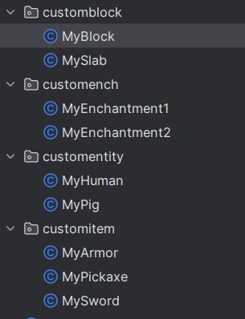

# 0.2 示例插件讲解
> 阅读此教程，你大致将了解PowerNukkitX提供的部分插件功能

## 一，获取官方示例插件
### 1.1 普通下载
官方示例插件分别在这两个地址，一个是Maven方式，一个是Gradle方式，你可以根据你使用的构建工具下载。
https://github.com/PowerNukkitX/ExamplePlugin-Maven
https://github.com/PowerNukkitX/ExamplePlugin-Gradle
<br />本文以Maven方式为例，解释示例插件

### 1.2 使用git拉取
Git下载官网地址：https://git-scm.com/downloads
1. 安装并配置完成后，使用git逐行输入下列命令。需要先生成ssh key，并配置到github
    ```shell
    git config --global user.name //配置用户名
    git config --global user.email //配置用户邮箱
    ssh-keygen -t rsa -C "your email" //生成ssh key
    ```
2. 查找ssh证书
   路径一般为 c:\users\Administrator.ssh
   <br />打开id_rsa.pub文件，复制其中的内容
3. 复制生成的ssh key到github
<br />打开github登录账号后，打开 setting ，再打开其中的 SSH and GPG keys, 再选择 New SSH key ，将 id_rsa.pub 中的内容复制到 key 中，Title 自定义， Add SSH key 完成添加

4. 打开 git bash进入你指定文件夹后， 使用如下命令即可
    ```shell
   git clone https://github.com/PowerNukkitX/ExamplePlugin-Maven.git
   ```

## 二，示例插件解释
### 2.1 插件是如何加载的
插件的加载由服务端进行管理，会自动加载位于plugins文件夹下的所有插件。
你会发现所有插件都是.jar后缀，JAR 文件就是 Java Archive File，顾名思意，它的应用是与 Java 息息相关的，是 Java 的一种文档格式。
<br />它包含了一个或多个 Java 类。JAR 文件可以包含任何类型的文件，比如 Java 源代码、图像文件、HTML 文件、文本文件等等。JAR 文件可以被 Java 虚拟机（JVM）直接执行，也可以被其他程序调用。
<br />我们的服务端通过读取插件里面的plugins.yml，来获取插件的名称，版本，作者等信息，并加载插件。
<br />下列是示例插件的resources/plugins.yml的示例
```yaml
#name为插件名称
#cn.powernukkitx.exampleplugin.ExamplePlugin为插件的入口类
#version为插件版本
name: ExamplePlugin
main: cn.powernukkitx.exampleplugin.ExamplePlugin
#请记住版本和 api是字符串类型，不要像这样写： 1.0.0，否则会出现异常
version: "1.0.0"
api: [ "2.0.0" ]
# load为插件加载顺序，只能填写 STARTUP 或 POSTWORLD
# STARTUP: 此时服务器刚启动，地图尚未加载，通常用于依赖库
# POSTWORLD: 此时服务器所有地图都加载完毕，通常填写POSTWORLD即可
load: POSTWORLD
#author和authors都为插件作者。Authors和author都会被添加到同一个列表
author: Nukkit Project
authors: ["Example", "Another"]
#description为插件描述
description: Example plugin showing the API
#表示这个插件的网站
website: https://github.com/PowerNukkitX/ExamplePlugin-Maven
# 这是一个可选的属性，用于指定插件的依赖。
# 依赖的格式为：
#depend: ["OtherPlugin", "ThisPlugin"]
# 这是不必要可选的插件依赖
softdepend: ["PluginA", "PluginB"]
# 表示这个插件在控制台输出log时的头衔
prefix: "Example"
# 插件将在这些插件之前加载。任何循环加载之前的插件或依赖项都会引发错误！
loadbefore: ["ImportantPlugin"]
```

还有更多选项如下:

- command 表示这个插件的命令列表
```yaml
command:
  exampleCommand:
    description: "Example command"
    #usage为命令用法
    usage: "example <arg1> <arg2>"
    #命令权限
    permission: "example.command.example"
    # 这是一个可选的属性，用于指定命令的子命令。
    subcommands:
      subcommand1:
        description: "Subcommand 1"
        usage: "example subcommand1"
        permission: "example.command.subcommand1"
```
- permission 表示这个插件的权限列表
```yaml
# defaualt为权限的默认值，可以是 OP, NOT_OP, TRUE, FALSE
#  op，代表服务器管理员，在ops.txt中规定。
#  notop，代表除服务器管理员外的所有玩家。
#  true，代表所有玩家。
#  false，代表空集。如果某个命令对应这个权限，那就没有人能够使用这个命令（控制台除外）。
permission:
  example.command.example:
    description: "Example permission"
    default: OP
     # children为权限的子权限
    children:
      example.command.subcommand1:
        default: NOT_OP
```
- feature 表示这个插件的特征列表(开启WsClient特性,应用于PNX-JS中)
```yaml
feature:
   - WsClient
```

在上述的plugin.yml文件中，你可以看到一个main的属性，它表示你的插件的主类。 主类是包含入口函数的类。入口函数是服务端当中规定的、可以用来作为程序入口的运行函数。

### 2.2 插件的主类
让我们来看看示例插件中的主类，启动IDEA，打开此项目
```java
package cn.powernukkitx.exampleplugin;

//导入库
import cn.nukkit.Server;
//...
import cn.nukkit.plugin.PluginBase;

//...

//继承了插件基类
public class ExamplePlugin extends PluginBase {

    @Override
    public void onLoad() {
        //...
    }

    @Override
    public void onEnable() {
        //...
    }

    @Override
    public void onDisable() {
        //...
    }
}
```

这上面有三个被覆写的方法，分别是onLoad、onEnable、onDisable。
表现在服务端中，这三个方法分别对应着服务端加载时、服务端启用时、服务端关闭时插件所运行的内容。是插件必须要写的三个方法。

<br />现在我们可以开始写一些在游戏内的功能了，接着看onLoad()函数
```java
@Override

public static ExamplePlugin INSTANCE;

@Override
public void onLoad() {
    //保存插件实例
    INSTANCE = this;
    //注册插件的i18n
    I18N = PluginI18nManager.register(this);
    //注册插件命令
    this.getServer().getCommandMap().register("exampleplugin", new ExampleCommand());
    //在控制台输出
    this.getLogger().info(TextFormat.WHITE + "The example plugin has been loaded!");

    INSTANCE = this;
    //尝试注册自定义内容，如物品，方块，实体，附魔
    try {
        Registries.ITEM.registerCustomItem(this, MyArmor.class, MySword.class, MyPickaxe.class);
        Registries.BLOCK.registerCustomBlock(this, MyBlock.class, MySlab.class);
        Registries.ENTITY.registerCustomEntity(this, new EntityRegistry.CustomEntityDefinition("powernukkitx:boar", "", false, true), MyPig.class);
        Registries.ENTITY.registerCustomEntity(this, new EntityRegistry.CustomEntityDefinition("powernukkitx:human", "", false, true), MyHuman.class);
        Enchantment.register(new MyEnchantment1(), new MyEnchantment2());
    } catch (RegisterException e) {
        throw new RuntimeException(e);
    }
}
```
服务器开启到停止只会调用一次该方法。我们需要把一些预处理代码放进去，比如检查和创建默认配置文件、初始化数组变量、注册内容等等。

```java
    @Override
    public void onEnable() {
        this.getLogger().info(TextFormat.DARK_GREEN + "The example plugin has been successfully launched!");
        this.getLogger().info(String.valueOf(this.getDataFolder().mkdirs()));

        //使用插件的i18n输出
        this.getLogger().info(I18N.tr(Server.getInstance().getLanguageCode(), "exampleplugin.helloworld", "世界"));

        //注册插件监听器
        this.getServer().getPluginManager().registerEvents(new EventListener(this), this);

        //插件多线程任务
        this.getServer().getScheduler().scheduleDelayedRepeatingTask(new BroadcastPluginTask(this), 500, 200);

        //保存Resource
        this.saveResource("string.txt");

        //Config文件的读写
        Config config = new Config(
                new File(this.getDataFolder(), "config.yml"),
                Config.YAML,
                new ConfigSection(new LinkedHashMap<>() {
                    {
                        put("this-is-a-key", "Hello! Config!");
                        put("another-key", true); 
                    }
                }));

        //现在尝试获取值，如果键不存在，将给出默认值！
        this.getLogger().info(String.valueOf(config.get("this-is-a-key", "this-is-default-value")));

        //千万别忘记保存！！！！！！
        config.save();
    }
```
onLoad()调用完成后，服务端会调用所有的onEnable()，onEnable()方法可能被调用多次。我们应该把读取配置文件，连接数据库这样在启动后可能需要停用的方法放在这里。

```java
    @Override
    public void onDisable() {
        this.getLogger().info(TextFormat.DARK_RED + "The example plugin has been disabled!");
    }
```
服务端关闭，或者一个插件onLoad()或onEnable()时发生问题，会调用插件的onDisable()方法。同onEnable()，onDisable()也可能被调用多次。
<br />我们应该把关闭数据库，关闭I/O数据流这样的东西放在这里。由于服务器过卡导致关闭时间太长，服务端会直接调用系统"杀死"自己，而导致一些插件的onDisable()不会被执行，所以我们在插件使用的过程中应该随时保存数据，尽量不要把I/O操作和保存数据部分放在onDisable()，以免意外发生。

### 2.3 插件的自定义内容
这是PowerNukkitX的一个特性，在PowerNukkitX中，插件可以自定义物品等等。
你可以看见示例插件的目录下有这么几个自定义内容。这些类似于写基岩addon时的行为包，目前编写此教程时，服务端并不能直接加载addon，但能通过编写插件时的代码来加载这些内容。



有行为包就会有资源包，资源包里存放着在插件自定义内容的材质，模型，音效等等。
<br />需要注意的是，使用插件的资源包时你可以放在跟java同级的resources/assets文件夹下，也可以放在服务端的resource文件夹下。
资源包的编写写法跟基岩版的资源包一样，所以编写自定义内容的材质之类的，也跟addon中编写材质中一样。
<br />**切记，在客户端加载新的资源包的时候，需要把旧的资源包删除再测试**

例如在textures/item_texture.json里:
```json
{
  "resource_pack_name": "vanilla",
  "texture_name": "atlas.items",
  "texture_data": {
    "pnx_armor": {
      "textures": "textures/items/pnx_armor"
    },
    "test_sward": {
      "textures": "textures/items/test_sward"
    },
    "amethyst_pickaxe": {
      "textures": "textures/items/amethyst_pickaxe"
    }
  }
}
```
"texture_data"里分别定义了三个自定义物品的材质。
<br />如果你还不知道基岩版的资源包怎么写，又或者对基岩版的addon不熟，可以参考这个wiki [基岩开发维基(全英文)](https://wiki.bedrock.dev)

在插件里继承核心内部逻辑，可以实现某些特殊物品/方块等等，例如自定义药水。这也是插件比addon更强大的地方。

### 2.3 事件监听器
PowerNukkitX的插件系统同样支持事件监听器，在插件主类注册完事件监听器以后，需要继承Listener
<br />来看示例插件中的EventListener.java
```java
public class EventListener implements Listener {
    private final ExamplePlugin plugin;
    private final AtomicInteger integer = new AtomicInteger(1);

    public EventListener(ExamplePlugin plugin) {
        this.plugin = plugin;
    }
    
    //当玩家在聊天框输入事件
    @EventHandler(priority = EventPriority.NORMAL)
    public void onChat(PlayerChatEvent event) { 
        if (event.getMessage().contains("test")) {
            System.out.println("spawn custom entities");
            //生成这俩实体
            new MyPig(event.getPlayer().getChunk(), Entity.getDefaultNBT(event.getPlayer())).spawnToAll();
            new MyHuman(event.getPlayer().getChunk(), Entity.getDefaultNBT(event.getPlayer())).spawnToAll();
        }
    }
    
    //服务端控制台命令事件
    @EventHandler(priority = EventPriority.NORMAL, ignoreCancelled = false) 
    public void onServerCommand(ServerCommandEvent event) {
        this.plugin.getLogger().info("ServerCommandEvent is called!");
    }

    @EventHandler(priority = EventPriority.NORMAL)
    public void onPlayerJoin(PlayerJoinEvent event) {
        this.plugin.getLogger().info(integer.getAndIncrement() + ":PlayerJoinEvent");
    }


    @EventHandler(priority = EventPriority.NORMAL)
    public void onPlayerLoginEvent(PlayerLoginEvent event) {
        this.plugin.getLogger().info(integer.getAndIncrement() + ":PlayerLoginEvent");
    }

    @EventHandler(priority = EventPriority.NORMAL)
    public void onPlayerRespawn(PlayerRespawnEvent event) {
        this.plugin.getLogger().info(integer.getAndIncrement() + ":PlayerRespawnEvent");
    }
}
```
调用处理器(EventHandler)时会按照优先级从低到高的顺序调用，这样保证了高优先级的监听器能覆盖低优先级监听器做出的处理。
<br />顺序如下，优先级依次降低
* EventPriority.LOWEST
* EventPriority.LOW
* EventPriority.NORMAL
* EventPriority.HIGH
* EventPriority.HIGHEST
* EventPriority.MONITOR

ignoreCancelled为定义这个处理器是否忽略被取消的事件。
如果为为true而且事件发生，这个处理器不会被调用，反之相反。

### 2.4 命令系统
在minecraft原版中，命令是必不可少的。命令系统是PowerNukkitX框架中一个重要的部分，它允许玩家通过输入命令来执行特定的操作。
跟事件系统类似，你需要先注册命令
<br />来看示例插件里的ExampleCommand.java
```java
public class ExampleCommand extends PluginCommand<ExamplePlugin> {

    public ExampleCommand() {
        /*
        1.命令名称必须小写
        2.这里的说明是用语言文件中的关键字设置的，如 en_US.lang 或 zh_CN.lang。
        这可以向不同语言的玩家发送不同的命令描述。
        您必须扩展 PluginCommand 才能拥有此功能。
        */
        super("examplecommand", "exampleplugin.examplecommand.description", ExamplePlugin.INSTANCE);

        //设置命令的别名
        this.setAliases(new String[]{"test"});
        
        //设置命令权限
        this.setPermission("exampleplugin.command.examplecommand.say1;exampleplugin.command.examplecommand.say2");

        /*
         * 下面开始设置命令参数，首先需要清理、
         * 因为 NK 默认会填写几个参数，我们不需要。
         * */
        this.getCommandParameters().clear();

        /*
         * 1.getCommandParameters 返回 Map<String,cn.nukkit.command.data.CommandParameter[]>、
         * 其中的每个条目可被视为子命令或命令模式。
         * 2.每个子命令不能重复。
         * 3.可选参数必须在子命令的末尾或连续使用。
         */
        this.getCommandParameters().put("pattern1", new CommandParameter[]{
                CommandParameter.newEnum("enum2", false, new CommandEnum("method", "say1")),
        });
        this.getCommandParameters().put("pattern2", new CommandParameter[]{
                CommandParameter.newEnum("enum2", false, new CommandEnum("method", "say2")),
                CommandParameter.newType("player", false, CommandParamType.TARGET, new PlayersNode()),
                CommandParameter.newType("message", true, CommandParamType.STRING)
        });
        this.getCommandParameters().put("spawn", new CommandParameter[]{
                CommandParameter.newEnum("enum2", false, new CommandEnum("spawn", "spawn")),
        });
       /*
        * 你会发现两个 `execute()` 方法、
        * 其中 `boolean execute()` 是旧的 NK 方法、
        * 如果你想使用新的 `int execute()`、
        * 必须在构造函数末尾添加 `enableParamTree`。
        *
        * 请注意，您只能从这两种执行方法中选择一种
        */
        this.enableParamTree();
    }
   /**
    * 只有在命令语法正确的情况下才会执行该方法，这意味着你不需要自己验证参数。
    * 此外，在执行命令之前，将检查执行者是否拥有执行命令的权限。
    * 如果不满足这些条件，将自动显示错误信息。
    *
    * @param sender 命令的发送者
    * @param commandLabel 命令标签。例如，如果使用了 `/test 123`，则值为 `test` 。
    * @param result 已解析的匹配子命令模式
    * @param log 命令输出工具，用于输出信息，可由世界的 sendCommandFeedback 规则控制
    */
   @Override
   public int execute(CommandSender sender, String commandLabel, Map.Entry<String, ParamList> result, CommandLogger log) {
      var list = result.getValue();
      switch (result.getKey()) {
         case "spawn" -> {
            ExamplePlugin.INSTANCE.getLogger().info("spawn custom entity");
            if (sender.isPlayer()) {
               Player player = sender.asPlayer();
               new MyPig(player.getChunk(), Entity.getDefaultNBT(player)).spawnToAll();
               new MyHuman(player.getChunk(), Entity.getDefaultNBT(player)).spawnToAll();
            }
         }
         case "pattern1" -> {
            System.out.println("execute say1");
         }
         case "pattern2" -> {
            System.out.println("execute say2");
            /*
             * 您需要使用相应的参数索引来获取解析值、
             * 每个不同的参数对应不同的返回值类型、
             * 会有一份文件供你查看
             */
            List<Player> players = list.getResult(1);

            //对于可选参数，您必须在得到结果之前判断它们是否存在
            if (list.hasResult(2)) {
               String message = list.getResult(2);
               /*
                * 1.log.addMessage 默认输出红色。
                *
                * 2.使用 TextFormat 添加彩色字符，注意语言键需要用 % 分隔。
                * 所有与语言键无关的文本必须用 % 分隔
                *
                * 3.addMessage 会自动翻译语言键、
                * 默认情况下，addSuccess 会输出白色、
                * 而 addError 则默认输出红色、
                * 除客户语言键外，其他文本均不翻译。
                */
               log.addMessage(TextFormat.WHITE + "%exampleplugin.helloworld% this is message:" + message, players.stream().map(Player::getName).toList().toString()).output();
            } else {
               log.addMessage(TextFormat.WHITE + "%exampleplugin.helloworld", players.stream().map(Player::getName).toList().toString()).output();
            }
         }
         default -> {
            return 0;
         }
      }
      // 返回 0 表示失败，返回 1 表示成功。
      // 这个值将应用于命令方块旁边的比较器。
      return 1;
   }
}
```

### 2.4 调度器
通过调度器，你可以实现像异步任务或者计时器的内容。如果直接new一个Thread()，会导致线程不安全。你也不可能直接sleep()，导致主线程宕机了。
<br />服务端提供了延迟，循环任务，一次性任务，等任务调度方法。
在示例插件中，调用了scheduleDelayedRepeatingTask()方法来重复延迟循环
```java
//cn.powernukkitx.exampleplugin.BroadcastPluginTask.java
public class BroadcastPluginTask extends PluginTask<ExamplePlugin> {

    public BroadcastPluginTask(ExamplePlugin owner) {
        super(owner);
    }

    @Override
    public void onRun(int currentTick) {
        this.getOwner().getLogger().info("我已经在游戏刻上跑了:" + currentTick);
    }
}
```

### 2.5 i18n
服务端提供了插件国际化功能。
<br />在示例插件下的resources/language文件夹下，提供了非常多的json翻译文件。像zh_CN.json，en_US.json，ja_JP.json等是语言文化代码，
cn_CN.json是中文翻译文件。
实现了示例插件中命令和控制台输出国际化。
```json
{
  "exampleplugin.helloworld": "你好 {%0}!",
  "exampleplugin.examplecommand.description": "这是一个测试命令。"
}
```
另外，如果资源包想要使用国际化，只需要在资源包的texts文件夹下，创建一个与语言代码相同的lang文件。不必在插件中使用i18n。
```lang
item.powernukkitx:pnx_armor=PNX ARMOR
item.powernukkitx:test_sward=PNX TEST ARMOR
item.powernukkitx:amethyst_pickaxe=amethyst pickaxe
tile.powernukkitx:redstoneluckyblock.name=红石幸运方块
tile.powernukkitx:blue_mahoe_slab.name=发光蓝盈木板
item.spawn_egg.entity.feral:boar.name=Spawn boar
entity.feral:boar.name=boar
```

### 2.5 更多
该教程只是快速入门，包括我没有讲实体，表单，物品，方块，玩家等等的具体内容。所有的API和功能，请参考服务端的具体源码。
如果有dalao想讲解更多内容，随时欢迎。