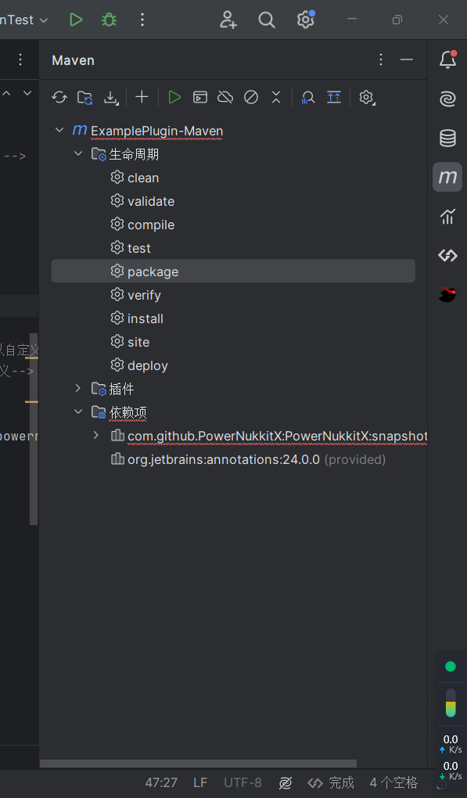
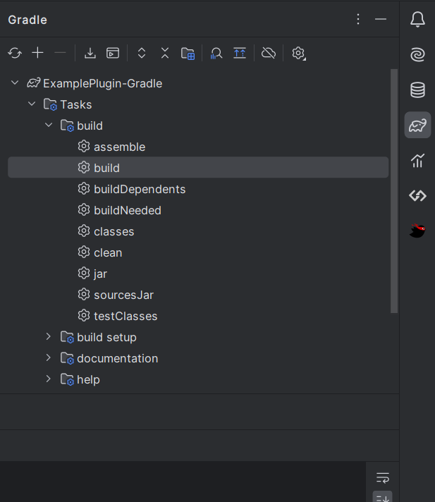
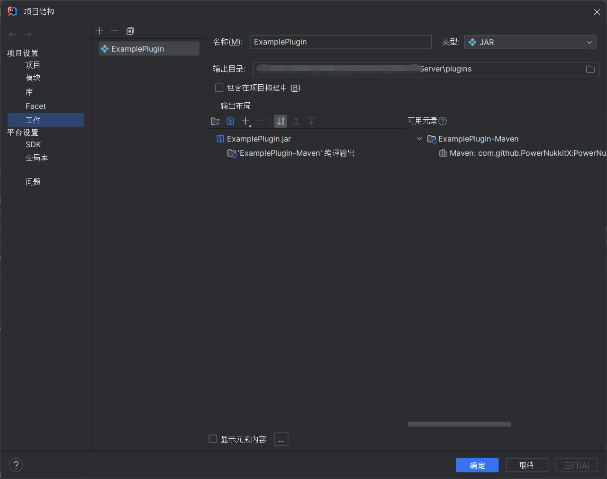
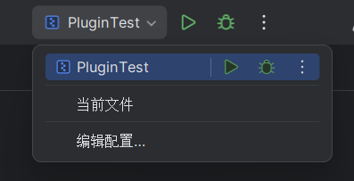
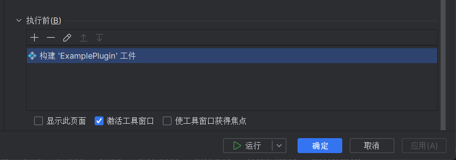
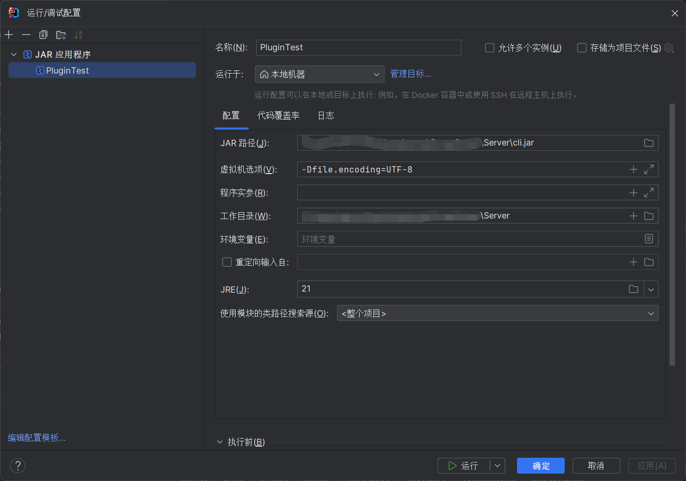
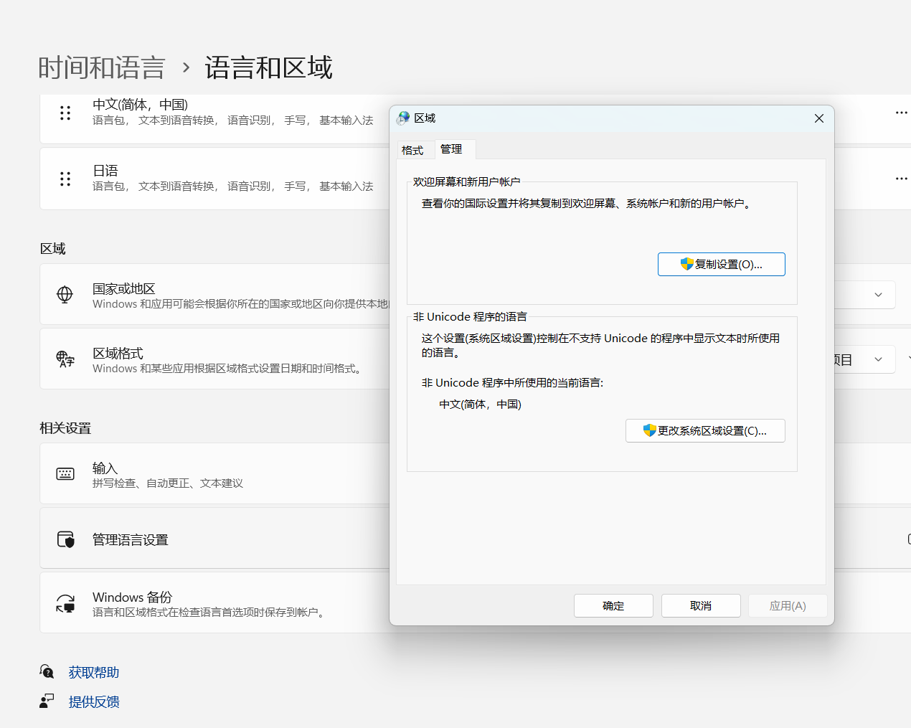

# 0.3 打包测试一条龙
> 阅读此教程，你将了解如何测试并打包PowerNukkitX的插件

该教程使用IDEA作为开发工具，如果你使用的是其他开发工具，请自行搜索相关教程。
<br />~~构建项目绝对是最蛋疼的一件事情~~

## 一、打包插件
### 1.1 使用Maven构建项目
我们不可能直接测试，先试试使用你的构建工具看看能不能构建项目。确保你在idea里能成功加载你使用的maven版本，或者在idea里安装maven插件。



直接点击package即可，等待构建成功。或者在你插件的根目录下，打开终端(这种方法基本都需要配置环境变量)，输入`mvn clean package`，等待构建完成。
<br />你的插件就在项目第一级的target目录下，插件名如"ExamplePlugin-Maven-1.0.0-SNAPSHOT"

一路顺风是不可能的，你可能会遇到各种问题，比如：
- 依赖无法下载

如果你的依赖无法下载，请检查用"木棍合成的梯子"，或者尝试使用国内镜像。
如果还是不行怎么办，把服务端直接下载到本地，在pom.xml下使用本地依赖
```xml
<dependency>
    <groupId>com.github.PowerNukkitX</groupId>  <!-- 库名称，也可以自定义 -->
    <artifactId>PowerNukkitX</artifactId>    <!--库名称，也可以自定义-->
    <version>snapshot</version> <!--版本号-->
    <scope>system</scope> <!--作用域-->
    <systemPath>{你的根目录}/powernukkitx.jar</systemPath> <!--项目根目录下的lib文件夹下-->
</dependency>
```

### 1.2 使用Gradle构建项目


点击`Build`，等待构建完成即可。或者像maven同理，在你插件的根目录下，打开终端(需要配置环境变量)，输入`gradlew build`。

## 二、测试插件
### 2.1 普通测试
打包完成之后，最简单粗暴的方式就是把打包完的插件直接放进启动过的服务端。
<br />当然频繁这样子是不行的，所以我有一个高招。在文件里打开项目结构中的工件，如图所示。新建一个空的JAR，把可用元素中的'ExamplePlugin-Maven'编译输出添加进输出布局中
<br />我们需要把打包后的插件加载到服务端中，所以我们把输出目录输出到你用于测试服务端中的plugin目录中


<br />以后的编译输出可以靠maven来管理，不用IDEA管理。接着开始配置测试，点击编辑配置。



我们的构建需要在服务端运行前，所以需要以下配置



重点看JAR路径和工作目录，用我们第一节启动服务端的方式启动服务端。
JAR路径填的是cli.jar的路径，工作目录就是cli.jar的同级目录



虚拟机选项里填的是-Dfile.encoding=UTF-8，保证终端中编码环境是UFT-8。
<br />最后点击运行就好了。

<br />**但是最重点的来了，你的cmd可能在默认情况下显示为GBK编码(~~血的教训~~)**，如果是这种情况运行服务端时，终端出现的中文可能是乱码。
<br />所以我以windows 11为例调整cmd的编码环境。
* 首先搜索"更改日期与时间"并打开

* 找到语言与区域，再点击管理语言设置
* 点击"更改系统区域设置"
* 把beta版打开就ok了

### 2.2 分析插件性能
服务端自带spark插件，关于用法文档在这里[spark](https://spark.lucko.me/docs/Command-Usage)
