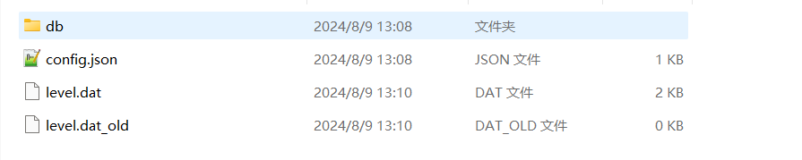
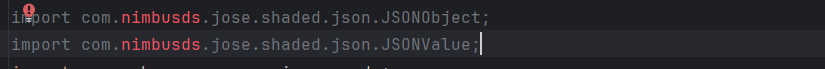

# 0.4 将服务端迁移至PNX

## 一，nk系列迁移至PNX
### 1.1 地图迁移
检查你的地图格式，是否属于基岩版的地图版本。
<br />如果是则可以直接迁移，相反需要使用像[Amulet](https://www.amuletmc.com/)的软件。或者使用在线地图转换[HIVE](https://chunker.app/)
将地图的文件夹放入服务端核心同级的worlds目录中，并在地图目录中创建一个名为`config.json`的文件。

我在里面填写以下内容：
```json
{
  "format": "leveldb",
  "enable": true,
  "generators": {
    "0": {
      "name": "flat",
      "seed": 0,
      "enableAntiXray": false,
      "antiXrayMode": "LOW",
      "preDeobfuscate": true,
      "dimensionData": {
        "dimensionName": "minecraft:overworld",
        "dimensionId": 0,
        "minHeight": -64,
        "maxHeight": 319,
        "height": 384,
        "chunkSectionCount": 24
      },
      "preset": {}
    }
  }
}
```
根据你的实际情况，参考[世界生成配置](https://docs-pnx.pages.dev/configuration/world-settings)

### 1.2 插件迁移
首当其冲的是，你需要把plugin.yml中的api改成2.0.0。并将依赖改为PNX
```yaml
api: [ "2.0.0" ]
```
然后启动IDEA这样的工具，检查插件中报错的地方，然后再修正错误的API。
在你想迁移的插件当中，应该会有大量本教程没有讲述过的东西，所以**以不变应万变，万变不离其宗**是根本道理。

我以Economy-API插件为例，修改成PNX能用的插件。
```xml
<project xmlns="http://maven.apache.org/POM/4.0.0" xmlns:xsi="http://www.w3.org/2001/XMLSchema-instance"
         xsi:schemaLocation="http://maven.apache.org/POM/4.0.0 http://maven.apache.org/xsd/maven-4.0.0.xsd">
    <modelVersion>4.0.0</modelVersion>

    <groupId>me.onebone</groupId>
    <artifactId>economyapi</artifactId>
    <version>2.0.4</version>
    <name>EconomyAPI</name>
    <url>https://github.com/Nukkit-coders/EconomyAPI</url>

    <repositories>
        <repository>
            <id>central</id>
            <url>https://repo.maven.apache.org/maven2/</url>
        </repository>
        <repository>
            <id>jitpack.io</id>
            <url>https://jitpack.io</url>
        </repository>
        <repository>
            <id>opencollab-repository-maven-releases</id>
            <name>Opencollab Repository releases</name>
            <url>https://repo.opencollab.dev/maven-releases</url>
        </repository>
        <repository>
            <id>opencollab-repository-maven-snapshots</id>
            <name>Opencollab Repository snapshots</name>
            <url>https://repo.opencollab.dev/maven-snapshots</url>
        </repository>
    </repositories>

    <properties>
        <maven.compiler.source>21</maven.compiler.source>
        <maven.compiler.target>21</maven.compiler.target>
        <project.build.sourceEncoding>UTF-8</project.build.sourceEncoding>
        <maven.build.timestamp.format>HHmm-ddMMyyyy</maven.build.timestamp.format>
    </properties>

    <dependencies>
        <dependency>
            <groupId>com.github.PowerNukkitX</groupId>
            <artifactId>PowerNukkitX</artifactId>
            <version>snapshot</version>
        </dependency>
    </dependencies>


    <build>
        <finalName>${project.name}</finalName>
        <defaultGoal>clean package</defaultGoal>
        <sourceDirectory>src/main/java</sourceDirectory>
        <resources>
            <resource>
                <filtering>true</filtering>
                <directory>src/main/resources/</directory>
            </resource>
        </resources>
    </build>
</project>
```
完成配置完依赖后，直接点击构建。你会发现好多爆红的东西(废话)，然后我们开始修改。发现调用的JSON库无了，我们直接调用PNX使用的GSON库



这是其中的几处,关于json的问题
```java
    private void importLanguages() {
        this.language = new HashMap<>();
        Gson gson = new Gson();
        for (String lang : langList) {
            InputStream is = this.getResource("lang_" + lang + ".json");
            try {
                JsonObject obj = gson.fromJson(Utils.readFile(is),JsonObject.class);
                //JSONObject obj = (JSONObject) JSONValue.parse(Utils.readFile(is));
                this.language.put(lang, obj);
            } catch (IOException e) {
                e.printStackTrace();
            }
        }
    }

    public String getMessage(String key, String[] params, String player) { 
        player = player.toLowerCase();
        JsonObject obj = this.language.get("def");
        //保证key的值为json里有的
        if (obj.has(key)) {
            String message = obj.get(key).getAsString();
    
            message = message.replace("%MONETARY_UNIT%", this.getMonetaryUnit());
    
            for (int i = 0; i < params.length; i++) {
                message = message.replace("%" + (i + 1), params[i]);
            }
            return TextFormat.colorize(message);
        }
        return "There are no message with key \"" + key + "\"";
    }
```

接下来就是命令部分，这些方法调用非常的久远，我们需要把他翻新一下。下面展示的是命令实现的其中之一

```java
    public MyMoneyCommand(EconomyAPI plugin) {
        super("mymoney", "Shows your money", "/money", new String[]{"money", "bal", "seemoney", "balance"});

        this.plugin = plugin;

        commandParameters.clear();
        commandParameters.put("default", new CommandParameter[]{
                //new CommandParameter("player", CommandParamType.TARGET, false)
                CommandParameter.newType("player", CommandParamType.TARGET)
        });
    }
```
现在基本可以测试了，但是如果放到实际生产过程当中。是不太行的，你看命令输出的时候都是英文，玩家100%看不顺眼。
所以我把他们的todo给写了，以及他们历史遗留命令`/setlang`

```java
    public String getMessage(String key, String[] params, String player) { // TODO: Individual language 已实现
            player = player.toLowerCase();
            //调用在这
            JsonObject obj = this.language.get(getLanguage());
            if (obj.has(key)) {
                String message = obj.get(key).getAsString();
    
                message = message.replace("%MONETARY_UNIT%", this.getMonetaryUnit());
    
                for (int i = 0; i < params.length; i++) {
                    message = message.replace("%" + (i + 1), params[i]);
                }
                return TextFormat.colorize(message);
            }
            return "There are no message with key \"" + key + "\"";
    }
    
    //对于在config.yml中language项的实现，目的在于获取目标的插件语言设置
    public String getLanguage() {
        if (this.getConfig().isString("data.language")) {
            return this.getConfig().getString("data.language");
        }
        return this.getConfig().getString("data.language", "def");
    }
```
    
```java
    public class SetLangCommand extends Command {
        private final EconomyAPI plugin;
    
        public SetLangCommand(EconomyAPI plugin) {
            super("setlang", "Sets your preferred language", "/setlang <ccTLD>");
            this.plugin = plugin;
            commandParameters.clear();
            commandParameters.put("default", new CommandParameter[]{
                    CommandParameter.newType("ccTLD", false, CommandParamType.STRING)
            });
        }
    }
    
    @Override
    public boolean execute(CommandSender sender, String label, String[] args) {
        if (!this.plugin.isEnabled()) return false;
        if (!sender.hasPermission("economyapi.command.setlang")) {
            sender.sendMessage(new TranslationContainer(TextFormat.RED + "%commands.generic.permission"));
            return false;
        }
    
        if (args.length < 1) {
            sender.sendMessage(new TranslationContainer("commands.generic.usage", this.getUsage()));
            return true;
        }
        String lang = args[0];
        /*
            langList有{"ch", "cs", "def", "fr", "id", "it", "jp", "ko", "nl", "ru", "zh"}
            他们使用的是ccTLD（全称是Country Code Top Level Domain），国家代码域名。你就知道ch是简体中文，def是英文就对了
        */
        String set = plugin.getLanguage();
        for (String element : EconomyAPI.langList) {
            if (Objects.equals(lang, element)){
                plugin.getConfig().set("data.language", lang);
                plugin.getConfig().save();
                sender.sendMessage(this.plugin.getMessage("language-set",new String[]{lang}, sender));
            }
        }
        if (!Objects.equals(set, plugin.getLanguage())){
            sender.sendMessage(this.plugin.getMessage("setlang-failed", sender));
            return false;
        }
        return true;
    }
```
我只在lang_ch里写了这个，其他语言并没有写。
```json
{
  "setlang-failed": "无法在插件中找到该语言预设"
}
```
最后不要忘记命令的权限设置，我在此不多叙述。

## 二，Spigot系服务端迁移至PNX
### 2.1 地图迁移
该内容与1.1内容一致，请参考1.1

### 2.2 插件迁移
你自己写吧孩子，为何跑来基岩受苦。不过PNX的API与bukkit api有类似之处，但是实现像很多好的插件内容起来还要从0开始。

## 三，BDS服务端迁移至PNX
### 3.1 地图迁移
将world目录中的地图文件直接迁移至PNX的worlds目录中即可。
并按1.1内容进行修改。

### 3.2 插件迁移
你需要一点小小的动手能力来完成这个任务。如果你使用LeviLamina加载器的话，那些主流插件功能几乎都有在Nukkit系列插件中实现过，迁移到PNX中，只需要改动就可以的。